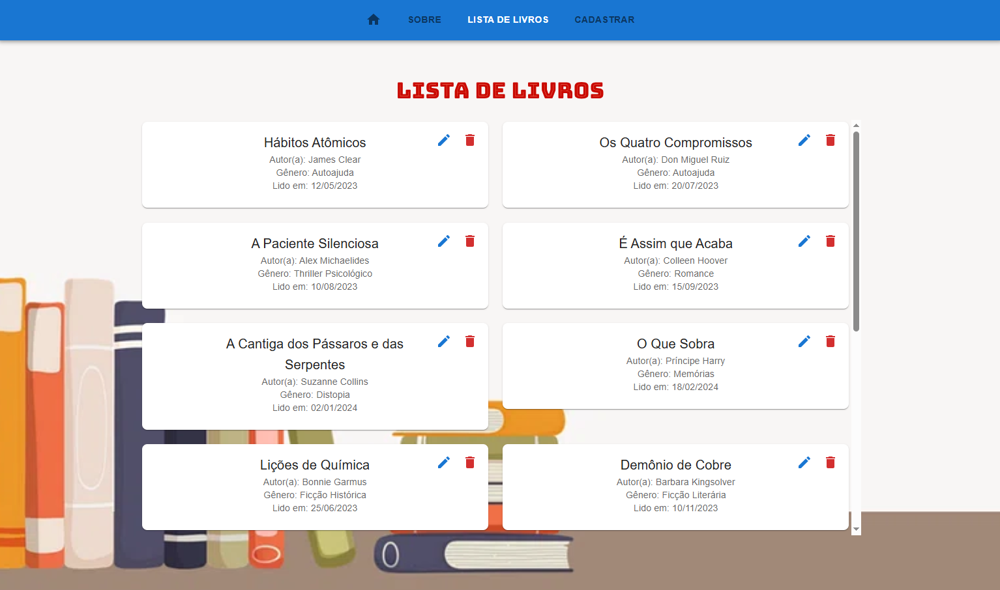
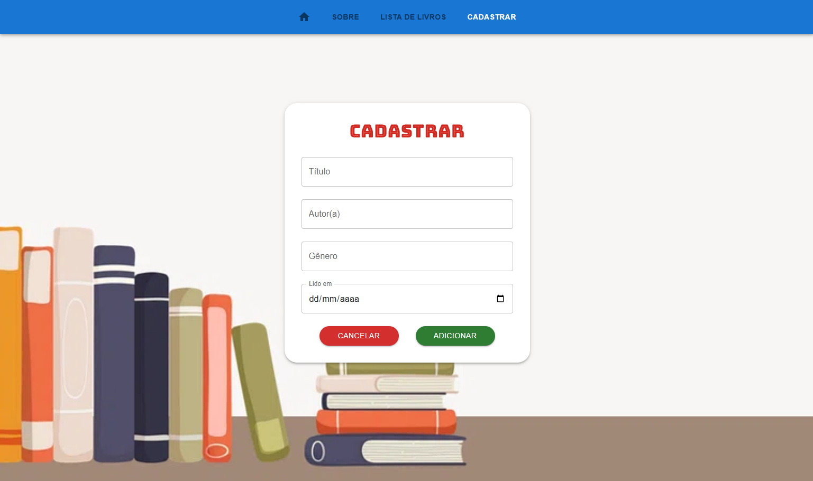

# :books: Reading Journal
## Nome: `William Renan Novak`

### :rocket: Como executar o projeto:

1. Execute npm install para instalar as dependências do projeto:
```
npm install
```

2. Iniciar a execução do projeto.
```
npm start
```

## :house: Introdução

Este é um projeto simples de gerenciamento de livros utilizando React e React Router.
As funcionalidades do sistema são adicionar, editar, excluir e listar os livros existentes.

## :file_folder: Componentes

Os componentes estão no diretório `./src/components` e eles possuem as seguintes características:
- **Navbar:** Este componente utiliza Link do React Router para mostrar as páginas disponíveis em uma barra de navegação
- **Home:** Página inicial do sistema.

- **About:** Página descritiva sobre o intuito do sistema.


- **BookList:**
  - `props`
    - books: array com a lista de livros existentes no sistema;
    - removeBook: função a ser chamada para realizar a exclusão de um livro do sistema;
  - Descrição: Este componente recebe os livros existentes via props e os exibe em uma listagem para o usuário.
  

- **BookForm:**
  - `props`
    - addBook: função que adiciona uma nova instância de um livro ao sistema;
    - updateBook: função que atualiza os dados de determinado livro existente no sistema;
    - books: array com a lista de livros existentes no sistema;
  - Descrição: Este componente retorna um formulário para o gerenciamento do cadastro e atualização de livros no Reading Journal.
  

## :computer: Tecnologias Utilizadas
- **React** (biblioteca principal)
- **React Router** (gerenciamento de rotas)
- **useState e useEffect** (gerenciamento de estado e efeitos colaterais)